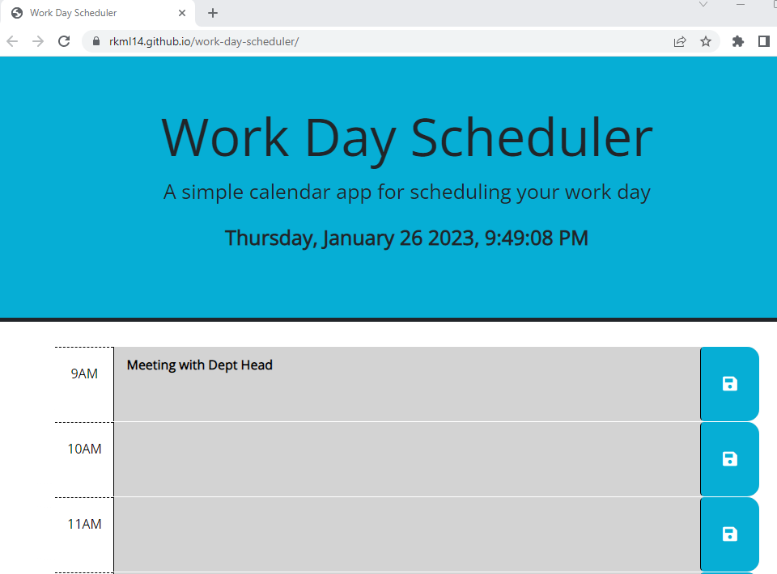

# 05  Work Day Scheduler

## Description

I created a simple calendar application that allows the user to save events for each hour of a standard business day (0am to 5pm).  The application runs in the browser and features dynamically updated HTML and CSS powered by jQuery, along with [Day.js](https://day.js.org/en/) library to work with date and time.  

In order for the user to manage their time effectively, they are presented with a daily planner to create their schedule with the current date & time displayed at the top of the calendar.   Each timeblock is color coded to indicate whether the time slot is in the past, present or future.   The user can enter their task into the appropriate time block and click the save button to retain their task.  When the user refreshes the page, the task is saved and persists in the planner for them.   

## Installation

Access the application via https://rkml14.github.io/work-day-scheduler/

## Usage

The user chooses the time slot for a task that is to be done, and can enter in information regarding said task and click on the save button to retain it.  They have the option of hourly time slots form 9am to 5pm in which they can enter in tasks to be completed.  The save button must be clicked in order to retain the task if the browser is closed or refreshed.  

   

## Credits

To my fellow UofT bootstrappers!

- Kirk Haggland 
- Mario Repas
- Cassandra Watson

 ## Author

Rebecca Lawrence
Rebecca Lawrence (https://github.com/rkml14/)

Live application: (https://rkml14.github.io/work-day-scheduler/)

## License

MIT License

Copyright (c) 2023 rkml14

Permission is hereby granted, free of charge, to any person obtaining a copy of this software and associated documentation files (the "Software"), to deal in the Software without restriction, including without limitation the rights to use, copy, modify, merge, publish, distribute, sublicense, and/or sell copies of the Software, and to permit persons to whom the Software is furnished to do so, subject to the following conditions:

The above copyright notice and this permission notice shall be included in all copies or substantial portions of the Software.

THE SOFTWARE IS PROVIDED "AS IS", WITHOUT WARRANTY OF ANY KIND, EXPRESS OR IMPLIED, INCLUDING BUT NOT LIMITED TO THE WARRANTIES OF MERCHANTABILITY, FITNESS FOR A PARTICULAR PURPOSE AND NONINFRINGEMENT. IN NO EVENT SHALL THE AUTHORS OR COPYRIGHT HOLDERS BE LIABLE FOR ANY CLAIM, DAMAGES OR OTHER LIABILITY, WHETHER IN AN ACTION OF CONTRACT, TORT OR OTHERWISE, ARISING FROM, OUT OF OR IN CONNECTION WITH THE SOFTWARE OR THE USE OR OTHER DEALINGS IN THE SOFTWARE.

